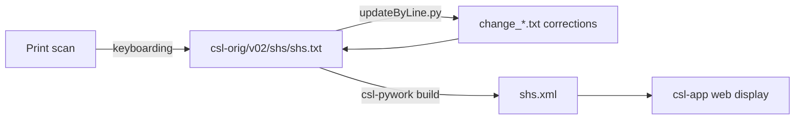

# SHS — *Shabda-Sagara* (Śabda-sāgara) (1900)

_Created: 21-12-2025 · Last updated: 05-07-2026_

Development and correction repository for **Kulapati Jibananda Vidyāsāgara's
*Shabda-Sagara, or A Comprehensive Sanscrit-English Dictionary***, a
46,730-entry Sanskrit→English dictionary, part of the [Cologne Digital
Sanskrit Lexicon](https://www.sanskrit-lexicon.uni-koeln.de/) (CDSL).
Empirically a descendant of Wilson (WIL ⊆ SHS ≈ 0.953 by headword
containment) in the CDSL genealogy — most of SHS's content traces back to
Wilson's dictionary, restructured and re-abbreviated.

---

## Why this repo exists

The canonical source text lives in
[`csl-orig/v02/shs/shs.txt`](https://github.com/sanskrit-lexicon/csl-orig/blob/master/v02/shs/shs.txt)
and is never edited directly — this repo holds the correction work: scripts
that reconcile discrepancies between the CDSL digitisation and an
independently-typed alternate edition (the "AB" data, see
[Issue #1](#issue-1--reconciling-the-ab-edition) below), per-issue working
files, and a faithful OCR + bilingual translation of the printed front
matter.

---

## Contents

| Path | Purpose |
|---|---|
| [`issues/`](https://github.com/sanskrit-lexicon/SHS/tree/main/issues) | Per-issue working files |
| [`prefaces/`](https://github.com/sanskrit-lexicon/SHS/tree/main/prefaces) | Front-matter OCR (title + abbreviations) with EN + RU — see [Front matter](#front-matter-prefaces) below |

---

## Usage: applying a correction (the general pattern)

Every dictionary repo in this org, SHS included, prepares corrections as a
change file and applies it with the shared
[`updateByLine.py`](https://github.com/sanskrit-lexicon/csl-pywork) script —
paired `N old …` / `N new …` (or `ins`/`del`) lines, run against the source
text:

```sh
python updateByLine.py <input_file> <changefile> <output_file>
```

SHS does not keep its own copy of `updateByLine.py` or of `shs.txt` in this
repo (both live in the `csl-pywork`/`csl-orig` sibling repos, fetched at
correction time) — so the command above is **illustrative of the standard
invocation**, not something you can run from a fresh clone of this repo
alone. What this repo *does* contain and *is* runnable directly is the
issue-1 reconciliation pipeline below.

### Issue #1 — reconciling the AB edition

[`issues/issue1/step1.py`](https://github.com/sanskrit-lexicon/SHS/blob/main/issues/issue1/step1.py)
and
[`issues/issue1/step2.py`](https://github.com/sanskrit-lexicon/SHS/blob/main/issues/issue1/step2.py)
are the actual scripts used to compare the CDSL digitisation against an
independently-produced "AB" (Andhra Bharati) electronic edition, which
turned out to carry richer markup (`<lex>`, `<ab>` tags the CDSL text had
stripped) — see
[`issues/issue1/README.md`](https://github.com/sanskrit-lexicon/SHS/blob/main/issues/issue1/README.md)
for the full structural diff between the two formats. The real worked
procedure, as documented there:

```sh
# 0. Pull the CDSL baseline from csl-orig (needs that sibling repo checked out)
cd sanskrit-lexicon/csl-orig
git show b877f841176786cb8e13775ea8bc15bc23018419:v02/shs/shs.txt \
  > ../../SHS/issues/issue1/temp_shs_0.txt

cd ../../SHS/issues/issue1

# 1. Derive a version from CDSL data programmatically
python3 step1.py        # temp_shs_0.txt -> temp_shs_1.txt

# 2. Derive a version from the AB data (shs-AB.txt) programmatically
python3 step2.py        # shs-AB.txt -> temp_shs_2.txt

# 3-5. Diff and manually reconcile (see issues/issue1/README.md for detail)
```

This is **marked illustrative** rather than independently re-executed here:
step 0 requires a checkout of the `csl-orig` repo at a specific historical
commit, which is outside this repo's own tree. `step1.py`'s transformation
logic (line-unwrapping, `<lex>`/`<ab>` tag insertion via a large
abbreviation table, sense-splitting) is real, committed code — read it
directly at
[`issues/issue1/step1.py`](https://github.com/sanskrit-lexicon/SHS/blob/main/issues/issue1/step1.py) —
but running it end-to-end needs that external input file, which is why the
org's correction convention keeps `temp_*` intermediate files out of
version control.

---

## Front matter (`prefaces/`)

Faithful OCR + translation of the dictionary's **front matter** — the
**title page** and the **List of Abbreviations** — from the Cologne scans,
with a Russian translation of each page. Source language is **English**, so
the base per-page `.md` is the English edition and each page also has a
`.ru.md`. Digitizer header/footer stamps are omitted.

- Cologne source: <https://sanskrit-lexicon.uni-koeln.de/scans/csldev/csldoc/build/dictionaries/prefaces/shspref.html>
- Consolidated editions: [prefaces/shspref_all.en.md](https://github.com/sanskrit-lexicon/SHS/blob/main/prefaces/shspref_all.en.md) · [prefaces/shspref_all.ru.md](https://github.com/sanskrit-lexicon/SHS/blob/main/prefaces/shspref_all.ru.md)
- In-folder index: [prefaces/README.md](https://github.com/sanskrit-lexicon/SHS/blob/main/prefaces/README.md)
- Imprint found: *First Edition, Calcutta 1900*, Calcutta Press (No. 8 Bowbazar Street), printed by Mookerjee & Co.; published by Ashu Bodha & Nitya Bodha Bhattacharyya.
- The Abbreviations page includes a Devanāgarī **साङ्केतिकाः शब्दाः** table (सङ्केतः → सङ्केतबोधः); its left abbreviation column is cut off in the binding margin of the scan and is marked `[?]`.

> **OCR run notes (2026-06-22)** — cost, timing, and technical lessons.
> Produced by the `/cologne-preface-ocr` skill (vision OCR + translation). Process retrospective, not part of the deliverable.
>
> **Method.** Done on the main thread (one dictionary at a time), not via parallel subagents: an earlier attempt that fanned out ~26 background OCR agents at once failed wholesale — long vision turns died on "Connection closed", the burst tripped a 403 auth/concurrency ceiling, and the flood of scan downloads temporarily IP-blocked us at sanskrit-lexicon.uni-koeln.de. Lesson: OCR these gently and sequentially, never in a large parallel burst.
>
> **Cost.** 2 pages, main-thread native-resolution cropping. The title page is large type (read from a thumbnail + native-res crops of the imprint); the Abbreviations page is dense (a two-column English list + a clipped/torn Devanāgarī table) and dominated the effort — ~30 native-res crop reads.
>
> **Technical lessons (reusable):** (1) The scans are 3540×4960 `.jpg`; crop to ≤1900 px and never upscale past 2000. (2) The leftmost Devanāgarī abbreviation column sits in the binding and is physically cut off — unrecoverable, marked `[?]` rather than invented. (3) A binding tear crosses the right English column and the Devanāgarī table; native crops still resolve the text. (4) Thumbnail reads mis-rendered "Parasmaipada"/"Penultimate" as "Paramaipada"/"Penultinate" — native crops corrected them.

---

## Timeline

| Period | Activity |
|---|---|
| 2025 | Repository activity begins (first tracked issues) |
| 2026-05 | Issue taxonomy, citation metadata, documentation |
| 2026-06 | Front-matter OCR + EN/RU translation of the prefaces (`prefaces/`) |

---

## Projects & Milestones

| Milestone | Open | Closed | Total |
|---|---|---|---|
| Dictionary to Book | 0 | 0 | 0 |
| Digitization Quality | 1 | 0 | 1 |
| Structured Data | 1 | 1 | 2 |
| Major Enhancements | 1 | 0 | 1 |
| **Total** | **3** | **1** | **4** |

### Open

| # | Title | Type | Severity | Milestone |
|---|---|---|---|---|
| 1 | EOL hyphen | encoding | minor | Digitization Quality |
| 3 | Questions for Andhrabharati | question | minor | Structured Data |
| 4 | docs-pass: SHS documentation review | content-enhancement | medium | Major Enhancements |

### Solved

| # | Title | Type | Severity | Milestone |
|---|---|---|---|---|
| 2 | [markup] Minor shs.txt Markup Oddities | markup | minor | Structured Data |

---

## Labels

### Type labels

| Label | Meaning |
|---|---|
| `link-target` | Click-throughs from `<ls>` abbreviations to scanned PDF pages |
| `link-splitting` | Splitting combined `SOURCE N,N` refs into per-page links |
| `markup` | Normalising XML tag content |
| `text-correction` | Corrections to English/Sanskrit definitions or headwords |
| `content-enhancement` | New material or structural additions beyond correction |
| `encoding` | SLP1/IAST transcoding, character normalisation |
| `scan-quality` | Replacing blurry/skewed/missing scan pages |
| `bug` | Broken links, XML errors, broken downloads |
| `question` | Scholarly questions requiring research |

### Severity labels

| Label | Meaning |
|---|---|
| `minor` | Targeted fix — a handful of lines or a single file |
| `medium` | Standard unit of work — one batch of corrections |
| `hard` | Large effort spanning many sources or files |

---

## Contributors

| Contributor | Commits |
|---|---|
| drdhaval2785 | 14 |
| gasyoun (Mārcis Gasūns) | 2 |
| funderburkjim | 2 |

---

## Source

- **Author**: Vidyāsāgara, Kulapati Jibananda
- **Title**: *Shabda-Sagara, or A Comprehensive Sanscrit-English Dictionary*
- **Place / Publisher**: Calcutta
- **Year(s)**: 1900
- **Language pair**: Sanskrit → English
- **Size (CDSL headword index)**: 46,730 entries
- **License (digital edition)**: CC BY-SA 4.0
- See [CITATION.cff](https://github.com/sanskrit-lexicon/SHS/blob/main/CITATION.cff) for machine-readable citation.

---

## Encoding

- UTF-8 (NFC) throughout.
- Sanskrit text in SLP1 transliteration, wrapped in `{#…#}`; English gloss / italic display text in ``.
- Devanāgarī and IAST display forms are generated at display time, not stored in the source.

---

## How it works



---

*Issue taxonomy and documentation per the [Cologne issue runbook](https://github.com/sanskrit-lexicon/csl-observatory/blob/main/runbook/cologne-issue-runbook.md).*

_Dr. Mārcis Gasūns_
